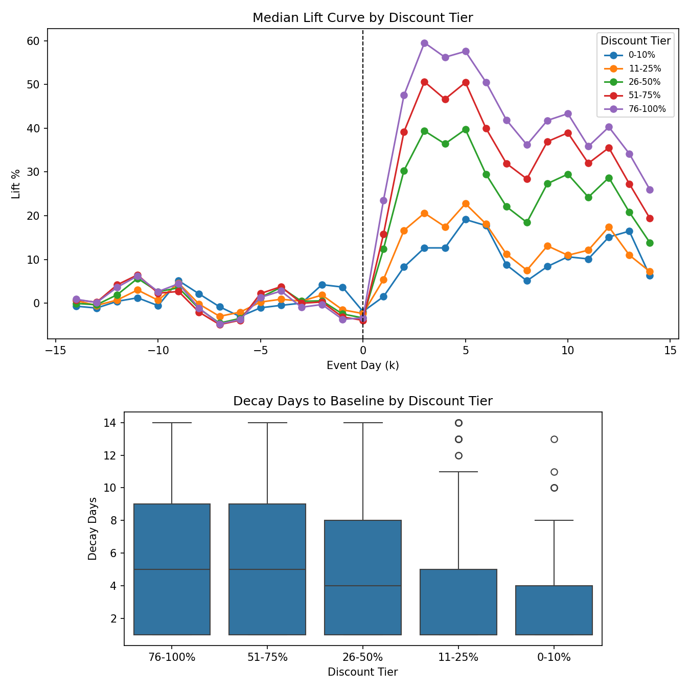

# Steam Discount Decision Pack
Make your next Steam discount a defensible decision: depth, timing, duration, and a 90-day schedule — delivered in a **48-hour turnaround**.

**Primary CTA:** Drop your `appID` + next beat date.
- Open a request: [New issue](../../issues/new) (include `appID`, goal, next beat date, and any constraints)

**Secondary:** [Request a 48-hour Decision Pack (2 minutes)](https://docs.google.com/forms/d/e/1FAIpQLSfHMP8RZxLca6Tv56k1vsuSPZeAESdGoMzrz-VKMipNI1SO1g/viewform)

---

## Who it’s for
**Fit**
- You have (or are about to have) a Steam store page and a real “next beat” (sale/update/fest/date).
- You want a decision you can defend: why this discount, why this window, why this duration.
- You’d rather run fewer, cleaner promos than “random discounting”.

**Not fit**
- You want guaranteed revenue outcomes or a growth promise.
- You need exact ROI/profit sizing but can’t share Steamworks exports (optional upgrade).
- You’re looking for someone to run ads/community/influencer execution (this is a decision pack).

## What you get
- **Mini (48-hour turnaround):** 1-page decision summary + depth/timing/duration recommendation + 90-day calendar starter + what to measure.
- **Standard (typically 5–7 days):** deeper memo + charts + a tighter playbook table you can reuse across future windows.
- **ROI Upgrade (typically ~3–4 weeks after exports):** net revenue/profit sizing by depth/region/frequency (requires Steamworks exports).

## Worked Example
**Situation:** Live indie at $14.99 with ~8k–15k wishlists; major update on 2026-03-12; recent promo means cooldown eligibility must be confirmed.
**Decision:** 20-30% for 5-7 days, timed 7-14 days before the beat (assuming Steam cooldown eligibility).
**Schedule:** Prep → promo window → cooldown/measure → update (kept clean) → checkpoint for the next window.
**Expected outcome (hypothesis):** meaningful conversion bump with less post-sale decay than deeper discounts; evaluate over 14-30 days.
**Risks:** mis-timing vs cooldown/build readiness; public signals are an engagement proxy (not revenue).

Full case study: [Synthetic worked example](./examples/worked_example.md).

## Pricing tiers
- **Mini:** fast, decision-focused (48-hour turnaround).
- **Standard:** more charts + tighter plan; slower delivery; still decision-focused (not execution).
- **ROI Upgrade:** adds net revenue/profit sizing; requires Steamworks exports; longer timeline.

## Request a Decision Pack
**Primary CTA:** Drop your `appID` + next beat date.
- Open a request: [New issue](../../issues/new)

**Secondary:** [Request a 48-hour Decision Pack (2 minutes)](https://docs.google.com/forms/d/e/1FAIpQLSfHMP8RZxLca6Tv56k1vsuSPZeAESdGoMzrz-VKMipNI1SO1g/viewform)

## FAQ
**What do you need from me?**
- `appID` (or Steam store link), your stage (pre-launch / launch / live), your next beat date, and your primary goal.

**What can you infer without Steamworks exports?**
- Public data supports engagement hypotheses (playercount + price/discount history). It cannot directly compute revenue/profit.

**What changes with the ROI Upgrade?**
- With Steamworks exports (units/revenue/refunds), we can quantify net impact by discount depth/region/frequency instead of treating lift as a proxy.

**Do you guarantee results?**
- No. The pack gives a clear decision, an operating schedule, and measurement plan; outcomes remain probabilistic and should be validated.
