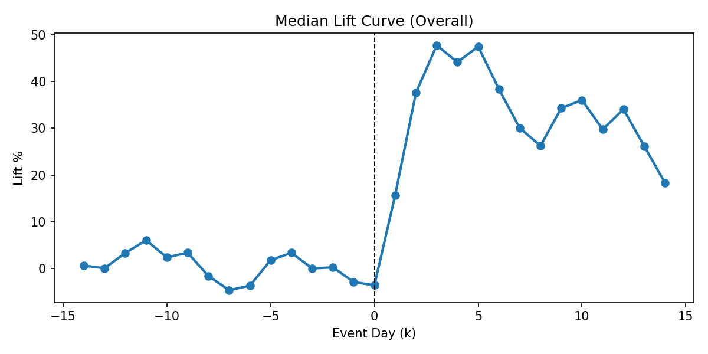

# Steam Discount Decision Pack 
A **48-hour Decision Pack (fast, decision-focused)** to choose discount depth, timing, and duration — with a 90-day calendar starter.

## How to use this (2 minutes)
- Read the [One-Pager](./client_preview_onepager.md)
- Skim the [Decision Memo](./decision_memo.md)
- Check the [Playbook Table](./playbook_table_public.csv)
- If you want ROI: use the [Data Request Checklist](./docs/DATA_REQUEST_CLIENT.md)

**Want this for your game?**  
🚀 **Fastest path:** [Request a 48-hour Decision Pack (2 minutes)](https://docs.google.com/forms/d/e/1FAIpQLSfHMP8RZxLca6Tv56k1vsuSPZeAESdGoMzrz-VKMipNI1SO1g/viewform)

**What you get (48-hour pack):**
- 1-page decision summary
- Discount depth/timing/duration recommendation
- 90-day calendar starter + what to measure

**What happens after you submit:**
1) You submit the form (Steam store link + stage + next beat)
2) I confirm constraints + timeline
3) You receive the pack (48-hour turnaround)

(Or [view existing requests](../../issues).)

---

## The impact (plain English)
Steam discounts aren’t “free marketing” — they’re a tradeoff. A discount that’s too deep (or too frequent) can train players to wait and shrink your future sales. A discount that’s too small (or mistimed) can waste a rare visibility window.

This Decision Pack turns “Should we do 20% or 40%?” into a clear, written plan you can execute.

**You walk away with:**
- A simple recommendation: **when to discount next**, **how deep**, and **for how long**
- A **90-day calendar** tied to your next beat (sale/update/fest), so you’re not guessing month-to-month
- A reusable **playbook** you can follow for future sale windows (not a one-off opinion)
- Optional upgrade: **ROI/profit view** (requires your Steamworks exports)

**What happens without this kind of analysis:**
- You pick discounts based on gut feel (or Twitter), then can’t explain *why* it worked or failed
- You over-discount and slowly teach your audience to wait for sales (hurts future launches/updates)
- You under-discount and miss your best visibility windows with a “meh” offer
- You run sales that clash with updates/fests, leaving money and momentum on the table
- You misread the Day 1 spike as “success” and don’t notice the post-sale drop-off until it’s too late

## What this is
I help Steam devs pick discount depth, timing, and duration using lift/decay patterns from historical sale episodes. The framework: goal → discount depth → timing → duration → next step.

You get a **Decision Pack** (one-pager + memo + proof charts + playbook table) plus a **90-day plan** you can execute.

**This public preview uses engagement signals only** (playercount + price history). **ROI/profit conclusions require Steamworks exports.**

### Preview the deliverable
- 👉 [Client Preview One-Pager](./client_preview_onepager.md)
- 👉 [Decision Memo](./decision_memo.md)
- 👉 [Public Playbook Table (Top 30)](./playbook_table_public.csv)
- 👉 [Client Data Request Checklist](./docs/DATA_REQUEST_CLIENT.md)
- 👉 [FAQ](./FAQ.md)
- 👉 [Public vs Private](./PUBLIC_VS_PRIVATE.md)
- 👉 [Service Offer](./SERVICE_OFFER_PUBLIC.md)
- 👉 [Request a 48-hour Decision Pack (2 minutes)](https://docs.google.com/forms/d/e/1FAIpQLSfHMP8RZxLca6Tv56k1vsuSPZeAESdGoMzrz-VKMipNI1SO1g/viewform)

## What's inside
- `client_preview_onepager.md` (preview deliverable)
- `decision_memo.md` (decision memo)
- `playbook_table_public.csv` (top 30 segments)
- `reports/figures/` (lift/decay charts)
- `docs/DATA_REQUEST_CLIENT.md` (client data checklist)
- `docs/REVENUE_ROI_PACK.md` (ROI upgrade details)
- `FAQ.md` (common questions)

## Signals map (Public vs Client)
| Signal | Public dataset (Mendeley) | Client data (Steamworks/partner) |
| --- | --- | --- |
| Playercount time series | Yes | Yes |
| Discount + list price history | Yes | Yes |
| Units sold | No | Yes |
| Net revenue + taxes/fees | No | Yes |
| Refunds/chargebacks | No | Yes |
| Wishlists + conversions | No | Yes |
| Regional/channel mix | No | Yes |

## Mini-Proof Preview (Example Output)

- Goal: Conversion (next sale window)
- Recommended discount depth: Mid discount (protects price integrity)
- Timing + duration: Align with next beat; keep duration tight
- Measure: Baseline shift over 14-30 days (ignore Day 1 spike)

