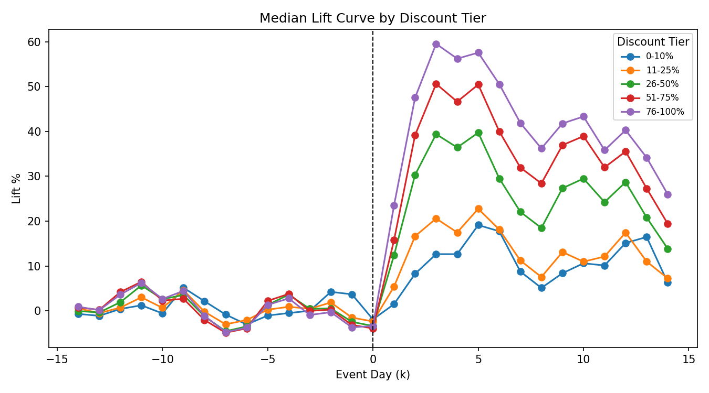
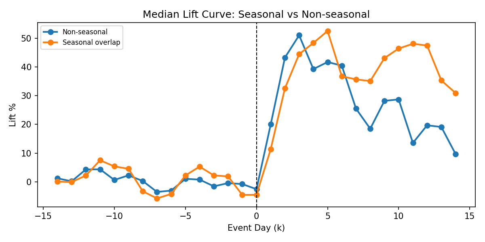
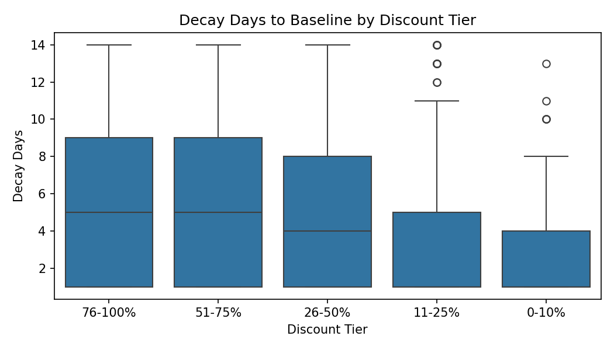

# Steam Promo ROI Client Preview (One-Pager)

**What this is:** A decision-ready preview using public Steam data (engagement lift) with a clear path to net revenue ROI once Steamworks exports are provided.

## 1) Public Top Segments (Public v1)
Source: `playbook_table_public.csv` (top 30 rows by median lift; rounded for public share).

| discount_tier_bucket | popularity_bucket | discount frequency_bucket | n_sales | median_peak_lift_pct | median_AUL | median_decay_days_to_baseline |
| --- | --- | --- | --- | --- | --- | --- |
| 51-75% | Q1 | mid | 650 | 239.1 | 9.6 | 4.0 |
| 76-100% | Q1 | mid | 356 | 228.4 | 8.99 | 4.0 |
| 51-75% | Q1 | high | 642 | 224.7 | 6.85 | 3.0 |
| 76-100% | Q1 | low | 205 | 218.2 | 10.09 | 4.0 |
| 51-75% | Q1 | low | 436 | 216.9 | 9.63 | 4.0 |
| 76-100% | Q1 | high | 353 | 158.7 | 5.48 | 3.0 |
| 26-50% | Q1 | low | 267 | 138.2 | 4.33 | 4.0 |
| 26-50% | Q1 | mid | 198 | 135.6 | 6.8 | 3.0 |
| 11-25% | Q1 | low | 31 | 128.5 | 6.25 | 3.0 |
| 76-100% | Q2 | low | 226 | 124.2 | 5.24 | 7.5 |

## 2) Evidence (Charts)
Overall lift curve:

Lift curve by discount depth:

Seasonal vs non-seasonal lift:

Decay by discount depth:

## 3) Actionable Recommendations (Guardrails)
1. **Prioritize mid-depth tiers (51-75%) for top-popularity titles**; these show the strongest median lift in the public table.
2. **Avoid extreme depths as default**; reserve 76-100% for targeted clearance windows with explicit goals.
3. **Use Steam-aware mechanism tags**: track wishlist-notify eligible sales (>=20% discount heuristic) and seasonal overlap separately.
4. **Set discount frequency caps** (e.g., no more than one major discount per 60-90 days) to reduce saturation risk.
5. **Predefine success metrics**: lift duration, decay speed, and baseline recovery window before repeating a discount depth.

## 4) 90-Day Plan (Skeleton)
- **Days 0-15:** Validate data drop, align on KPI definitions, confirm timezone + app_id mapping.
- **Days 16-45:** Build revenue ROI tables by discount depth/region/discount frequency; deliver draft promo plan.
- **Days 46-75:** Run 1-2 controlled discount depth tests; monitor lift and decay; adjust thresholds.
- **Days 76-90:** Finalize ROI-backed playbook + decision memo.

## 5) What I Need From You
Provide the minimum or gold-standard data drop listed here:
- `../docs/DATA_REQUEST_CLIENT.md`

## Upgrade Path: Revenue ROI Pack
Public data shows engagement lift, but ROI requires net revenue exports. The upgrade pack delivers ROI by discount depth, refund-adjusted impact, and region-specific promo guidance:
- `../docs/REVENUE_ROI_PACK.md`

